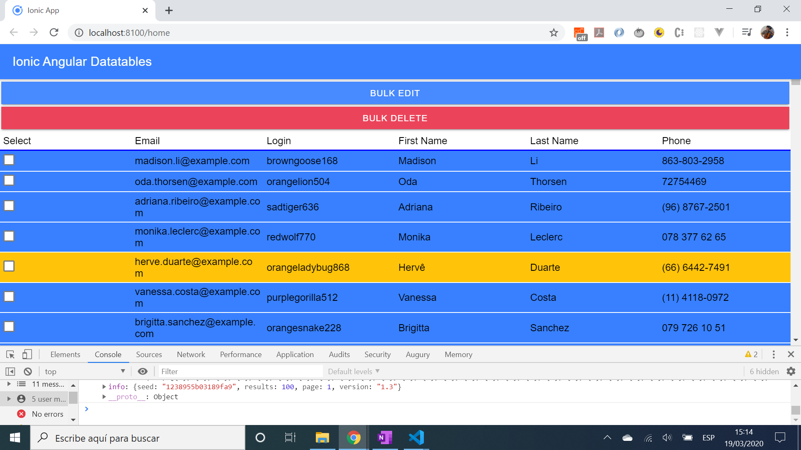
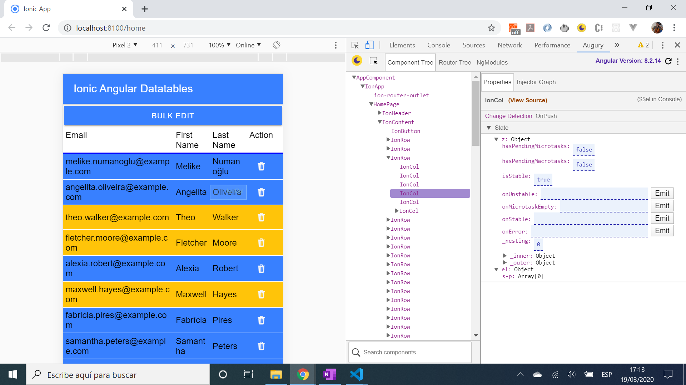

# Ionic Angular Datatables

* App to display a responsive table of data from an API, using the [Ionic 5 framework](https://ionicframework.com/docs) with Angular
* Code from [Simon Grimm: Youtube video: Building a Responsive Data Table with Ionic Grid](https://www.youtube.com/watch?v=5xQlIYHgesg&t=5s) with some styling changes

## Table of contents

* [General info](#general-info)
* [Screenshots](#screenshots)
* [Technologies](#technologies)
* [Setup](#setup)
* [Features](#features)
* [Status](#status)
* [Inspiration](#inspiration)
* [Contact](#contact)

## General info

* App gets data from a [random user details API](https://randomuser.me/) and displays it in a responsive table that, upon reesizing, reduces the number of columns from 6 (PC screen) to 4 (mobile screen)

## Screenshots




## Technologies

* [Ionic/angular v5.0.0](https://ionicframework.com/)
* [Ionic v5.0.0](https://ionicframework.com/)
* [Angular v8.2.14](https://angular.io/)

## Setup

* Load dependencies using `npm i`
* To start the server on _localhost://8100_ type: `ionic serve`

## Code Examples

* `bulkDelete()` method uses checkbox column result to remove rows checked

```typescript
  // take items checked - this.edit - and filter indexes and coerce into a number
  // remove rows with this index using the splice method
  bulkDelete() {
    console.log('this.edit: ', this.edit); // example: returns {0: true, 1: true, 2: true}
    const preDelete = Object.keys(this.edit);
    console.log('preDelete', preDelete) // example returns ["0", "1", "2"] - array of strings
    const deleteList = preDelete.filter(index => this.edit[index]).map(key => +key); // [0, 1, 2]
    while (deleteList.length) { // as long as deleteList is > 0 
      this.data.splice(deleteList.pop(), 1) // splice each row[item], pop deleteList down each time
    }
    this.toggleBulkEdit(); // boolean switched to hide bulkEdit ion-button once complete
  }

```

## Features

* Sort function uses the [localeCompare()](https://developer.mozilla.org/en-US/docs/Web/JavaScript/Reference/Global_Objects/String/localeCompare) method to return a number indicating if a reference string comes before or after or is the same as the given string in sort order.
* `ion-select-option` used to provide drop-down rows per page options. Couldn't work out how to have a default selected value, e.g. 10, currently defaults to the full list until a rows per page option is chosen

## Status & To-do list

* Status: working.
* To-do: add commenting and functionality

## Inspiration

* [Simon Grimm: Youtube video: Building a Responsive Data Table with Ionic Grid](https://www.youtube.com/watch?v=5xQlIYHgesg&t=5s).
* [Simon Grimms great Ionic site: Devdactic](https://devdactic.com/)

## Contact

Repo created by [ABateman](https://www.andrewbateman.org) - feel free to contact me!
